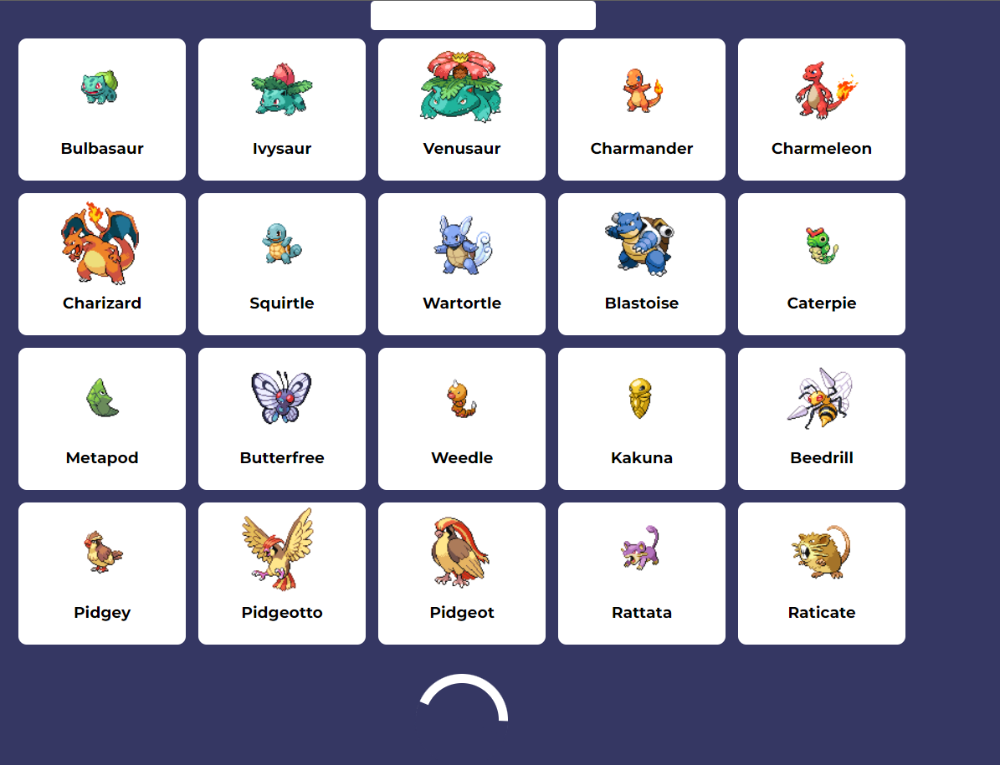
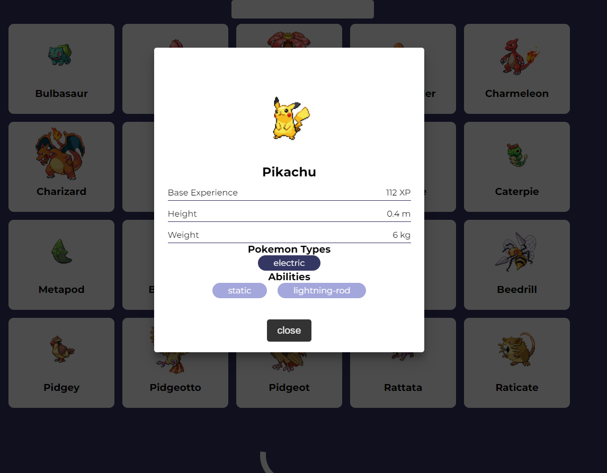

# alliance-test
В этом тестовом задании необходимо было вывести покемонов, также реализовать пагинацию с поиском. При этом чтобы при обновлении страницы состояние страницы не менялось. 




## Project setup
```
npm install
```

### Compiles and hot-reloads for development
```
npm run serve
```

### Compiles and minifies for production
```
npm run build
```

### Lints and fixes files
```
npm run lint
```

### Customize configuration
See [Configuration Reference](https://cli.vuejs.org/config/).
